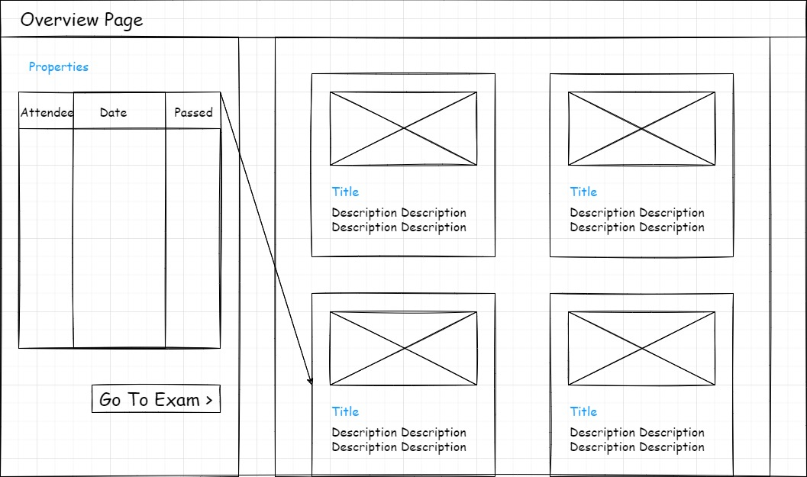

# Exams/Intro-Webapplikasjoner

## Oppgave 1

* As an administrator, I want to create templates from an exam, so that newer exams can follow a similar structure.
* As an attendee, I want to create my own profile, so that I can track my progress on my education.
* As an attendee, I want to have a progress bar, so that I can keep track of my performance during the examination.
* As an administrator, I want to have full control when editing the exam, so that the it fits a format best suited for the course.
* As a company, I want to create questions to a specific module, so that the attendees can be tested with real scenarios.

## Oppgave 2

## Oppgave 3

## Oppgave 4

Har gjort som beskrevet

## Oppgave 5

Har gjort som beskrevet

## Oppgave 6

Link to trello: https://trello.com/b/aIpH12I1/agile

I didn't find how to create an epic, but I added the Epic by Screenful power-up.

